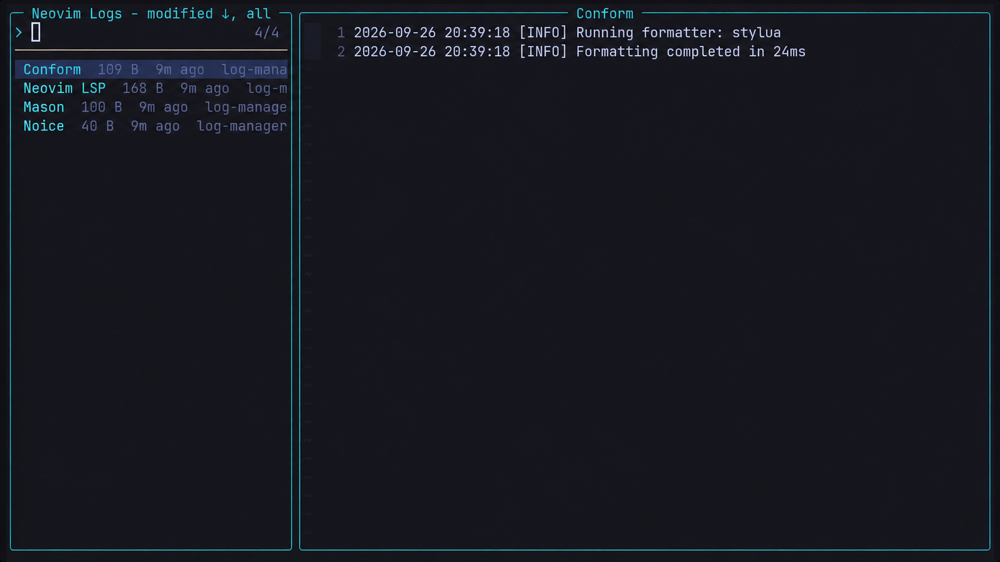

# log-manager.nvim

A Snacks-powered browser for Neovim and plugin log files.

It searches Neovim's standard state, cache, and data directories, identifies the
plugin that produced each log using human-facing names such as `Mason` and
`Conform`, and provides searchable previews and safe actions for opening,
clearing, or deleting logs. Logs can be sorted by last modified time, producer
name, or file size.



## Commands

- `:LogManager` opens the log browser.
- `:LogManagerCleanup` deletes logs older than `cleanup_days` after confirmation.
- `:LogManagerHealth` loads the plugin and reports dependency and discovery
  problems. After the plugin is loaded, `:checkhealth log-manager` works too.

Inside the Snacks picker:

| Key | Action |
| --- | --- |
| `<Enter>` | Open the selected log |
| `c` | Clear the selected log without deleting it |
| `d` | Delete the selected log |
| `C` | Clear all discovered logs |
| `s` | Cycle sorting between last modified, name, and size |
| `r` | Rescan logs without closing the picker |
| `<Tab>` | Select multiple logs for clear, delete, or copy actions |
| `y` | Copy the selected log paths |
| `R` | Reveal the selected log's directory |
| `G` | Open the selected log at its end |
| `F` | Follow the selected log in a live buffer |
| `X` | Delete logs older than `cleanup_days` |
| `?` | Show picker keybindings and actions |
| `<Space>` | Open the action menu |

The same actions work from the input with `<C-c>`, `<C-d>`, `<C-a>`, and
`<C-s>`. `<C-Space>` opens the action menu from the input. Following uses a
native Neovim buffer, so it does not require an external `tail` command.

Clear and delete confirmations include the affected
paths, including a short path list for bulk selections.
Standard Snacks mappings can open an entry in a split or tab.

Modified time and size sort from highest to lowest; names sort alphabetically.
The picker footer shows the active sort field and direction.

## lazy.nvim

```lua
{
  dir = vim.fn.expand '~/dev/log-manager.nvim',
  cmd = { 'LogManager', 'LogManagerCleanup', 'LogManagerHealth' },
  dependencies = { 'folke/snacks.nvim' },
  opts = {},
}
```

Optional configuration:

```lua
require('log-manager').setup {
  max_depth = 4,
  sort = 'modified', -- 'modified', 'name', or 'size'
  sort_direction = nil, -- defaults to ascending for name, descending otherwise
  cleanup_days = 30,
  roots = {
    vim.fn.stdpath 'state',
    vim.fn.stdpath 'cache',
    { path = vim.fn.stdpath 'data', max_depth = 2 }, -- optional per-root depth
  },
  patterns = { '%.log$', '/log$' },
  ignore = { '/large%-cache/' }, -- Lua patterns matched against full paths
  files = {
    -- Explicit files do not need to match `patterns`.
    function()
      return vim.lsp.log.get_filename()
    end,
  },
  filters = {
    min_size = 0,
    modified_after = nil, -- Unix timestamp
    names = nil, -- optional producer-name allowlist
  },
  preview = {
    max_size = 1024 * 1024,
    tail_lines = 500, -- large files preview only their final lines
  },
  names = {
    ['my-plugin.log'] = 'My Plugin',
  },
}
```

List options (`roots`, `files`, `patterns`, and `ignore`) replace their defaults.
Map options such as `names`, `filters`, and `preview` merge with their defaults.

## Testing

Run the self-contained test suite with:

```sh
nvim --headless -u NONE -i NONE -l tests/run.lua
```
